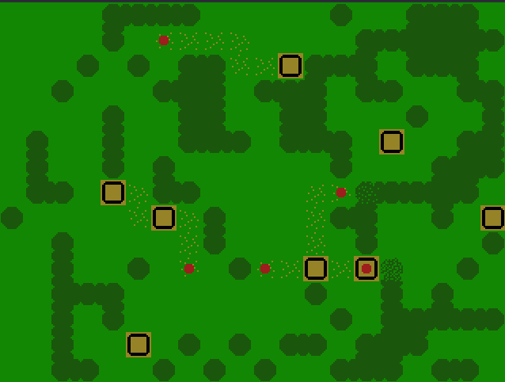

# Pathfinders

## Overview

A very weird PyGame simulation that looks at how the location of routes and roads are decided.

The simulation consists of a world with a few villages.
* As people travel between the villages, they take the easiest path
* They will avoid forests if possible, or cut them down if there isn't another option
* As people travel, the paths start to form
* At the same time, vegetation regrows on less-traveled paths

<br>

## Demo



<br>

## How to Run

```
$ pip install pygame
$ python main.py
```

<br>

## Future Ideas
- Add more obstacles, like rocks and bodies of water
- Click interagtions for changing the world layout